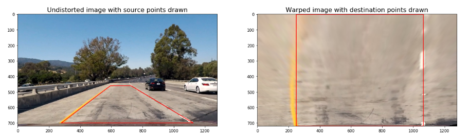

## Writeup Template

**Advanced Lane Finding Project**

The goals / steps of this project are the following:

* Compute the camera calibration matrix and distortion coefficients given a set of chessboard images.
* Apply a distortion correction to raw images.
* Use color transforms, gradients, etc., to create a thresholded binary image.
* Apply a perspective transform to rectify binary image ("birds-eye view").
* Detect lane pixels and fit to find the lane boundary.
* Determine the curvature of the lane and vehicle position with respect to center.
* Warp the detected lane boundaries back onto the original image.
* Output visual display of the lane boundaries and numerical estimation of lane curvature and vehicle position.


### Writeup / README

Starting this project post the Lane Finding project (lesson), it was time to implement better techniques for lane detection.
While going through the lessons, we learnt that for apt lane detection, we have to do a lot of things:
       1. Camera Calibration - This includes Image / Video Distortion correction. Since the cameras may detect images (and/or video) which may get distorted due to camera placement or lens. Once this is done, we can start apllying the later techniques.
       2. Transformations / Binary image creation - since it is easier to work and apply techniques on binary images, we convert the required undistorted image in the binary format. Using Sobel transforms, bird's eye view will help achieve this. 
       3. Lane Detection and Curvature detection - Since the lanes in the sample video may not be straight (as is the case in the sample video), we might need to capture the curve of the lane in order to get a clear patch of lane.
       4. Once the patch is recognised, we will warp it with a boundary over the original image and show the numerical estimation of curvature and vehicle's position
       5. Pipeline all the images in a video
       
Here are the steps I followed to prepare the pipeline of the project:
     1. Step  1 - Import the packages required for the project
     2. Step  2 - Calibrate the camers using the chessboard image (technique)
     3. Step  3 - Correct the distorted image (chessboard) and apply the same to the raw camera images
     4. Step  4 - Using color transforms, apply gradients and create threshold Binary Image
     5. Step  5 - Apply the perspective transform - the Bird's Eye view technique
     6. Step  6 - Detect the lane pixels and fit a boundary on the detected lane
     7. Step  7 - Determine the curvature of lane and the vehicle's position 
     8. Step  8 - Warp the lane boundaries on the original image 
     9. Step  9 - Display the lane boundaries and the numerical estimations 
    10. Step 10 - Pipeline the video
    
    
### Pipeline (single images)

#### Step 1 : Import the required packages to run the program

To run the progam, import the default libraries. numpy, openCV, matlplotlib, moviepy are the ones used.
*Note: The imageio version 2.5.0 kept giving an error; downgraded it to 2.4.1 and the program ran locally*

#### Step 2. Calibrate the camera using the chessboard images

To calibrate the camera which may capture images that contain distorton due to various reasons like camera placement or lens curvature. To overcome the same, I used a chessboard image. 
The corners of the chessboard get distorted (if camera distortion is present). 
- Read the chessboard image using *cv2.imread*
- convert it into the grayscale using *cv2.cvtcolor*
- Find the corners of the chessboard using function *cv2.findChessboardCorners*
- The chessboard corners are used to calibrate the camera by invoking *cv2.calibrateCamera*

The returned values will help undistort the camera captures raw images.

#### Step 3. Correct the distorted image and apply the correction to the raw images.

Applying the *cv2.undistort* function, we undistort the chessboard image. 

The changes can be best reflected in the image below:


#### Step 4: Using color transforms, gradients, etc. and create the threshold Binary Image

We calculate the several gradient measurements (x, y, magnitude, direction and color) by the following functions:

- *abs_sobel_thresh()* : To calculate the directional gradient .
    Gives the below outputs:
    
    
- *magn_thresh()* : To calculate the gradient magnitude.
    Gives the output:
    
- *dir_thresh()* : To calculate the gradient direction.
    Gives the below output:
    
- *col_thresh()* : To calculate the color threshold.
    Gives the below output:
    
    
Combining all the thresholds together, function *combine_thresh()* is used. Below is the output:


#### Step 5: Applying the perspective transform - Bird's eye view

After applying the color transform and the gradient thresholds, we will convert the image to the bird's eye view.

We will encompass the boundaries over the patch of the lane with the help of the coordinates. This is the bird's eye view and looks similar to a rectangle.
Now, we define how the trapezoid looks like using the destination coordinates.
Then we apply the function *cv2.getPerspectiveTransform* to calculate the perspective transform _M_ and the inverse perspective transform _Minv_

We now warp the boundaries over the image and here is how it looks:



The code for the `warp()` function can be found below:

```python
# Define perspective transform function
def warp(img, src_coordinates=None, dst_coordinates=None):
    # Define calibration box in source (original) and destination (desired or warped) coordinates
    img_size = (img.shape[1], img.shape[0])
    
    
    if src_coordinates is None:
        src_coordinates = np.float32(
            [[280,  700],  # Bottom left
             [595,  460],  # Top left
             [725,  460],  # Top right
             [1125, 700]]) # Bottom right
        
    if dst_coordinates is None:
        dst_coordinates = np.float32(
            [[250,  720],  # Bottom left
             [250,    0],  # Top left
             [1065,   0],  # Top right
             [1065, 720]]) # Bottom right   

    # Compute the perspective transfor, M
    M = cv2.getPerspectiveTransform(src_coordinates, dst_coordinates)

    
    # Compute the inverse perspective transfor also by swapping the input parameters
    Minv = cv2.getPerspectiveTransform(dst_coordinates, src_coordinates)
    
    # Create warped image - uses linear interpolation
    warped = cv2.warpPerspective(img, M, img_size, flags=cv2.INTER_LINEAR)

    return warped, M, Minv
```


#### Step 6: Detecting the lane pixels and lane boundary fitting 

To detect the lane pixels from the warp image, here are the steps:

- Histogram is created; for the lower half of the image. 
    


```python
def get_histogram(img):
    return np.sum(img[img.shape[0]//2:, :], axis=0)

# Run de function over the combined warped image
combined_warped = warp(combined)[0]
histogram = get_histogram(combined_warped)

# Plot the results
plt.title('Histogram', fontsize=16)
plt.xlabel('Pixel position')
plt.ylabel('Counts')
plt.plot(histogram)
```

- Now, the left and right starting lanes are selected wrt to the max value of the histogram to the left and right of histogram's mid position.
- *Sliding Window* technique is used to identify the coordinates of the lane lines.
- Second order polynomial is calculated for left and right lane lines using the previously calculated coordinates. *np.polyfit* is the function used for the same. Below is the result:


now, we use the *detect_similar_lines()* to detect the lane lines which aregoing to be alike in the video. Here's how it looks:


#### Step 7: Determine the curvature of lane and the vehicle's position 

The radius of curvature and the vehicle's position is found out by the functions *curvature_radius()* and *car_offset()* respectivley. 
the code can be checked in the ipynb file, not populating the code here.

#### Step 8: Warp the lane boundaries on the original image 

Having populated the curvature and the vehicle position, we identified have the lane lines identified. 
Now, we need to warp the boundaries on the original image. 
We use the *cv2.fillPoly()* to warp the blank image.
Now, using the Inverse Perspective Matrix _Minv_ we warp the image over the blank image. 

This is how it looks now: 


#### Step 9: Display the lane boundaries and along with the numerical estimations

Now, the numbers are to be displayed on the image.
Function *add_metrics()* is used to put the numerical estimations over the image.
Here is the result:


#### Step 10: Run the Pipeline Video

A class has been used to process the image rather than a function as the calibration of the camera will retain old values while initializing the class.

![alt text][image6]

```python
perspective transform to rectify binary image ("birds-eye view")
        src_coordinates = np.float32(
            [[280,  700],  # Bottom left
             [595,  460],  # Top left
             [725,  460],  # Top right
             [1125, 700]]) # Bottom right

        dst_coordinates = np.float32(
            [[250,  720],  # Bottom left
             [250,    0],  # Top left
             [1065,   0],  # Top right
             [1065, 720]]) # Bottom right   

        combined_warp, _, Minv = warp(combined, src_coordinates, dst_coordinates)
                
        self.lines_fit, left_points, right_points, out_img = detect_similar_lines(combined_warp, self.lines_fit, return_img=True)

        # Warp the detected lane boundaries back onto the original image.
        img_lane = draw_lane(img, combined_warp, left_points, right_points, Minv)
            
        # Add metrics to the output img
        out_img = add_metrics(img_lane, leftx=left_points[0], rightx=right_points[0])
            
        return out_img
```

Moviepy is used to stitch the frames and produce the output. Here's the output file:
[output video](project_video_solution.mp4)

### Discussion

#### 1. Briefly discuss any problems / issues you faced in your implementation of this project.  Where will your pipeline likely fail?  What could you do to make it more robust?

There were two runtime issues I encountered:
1. *imageio* version 2.5.0 does not recognise the functions properly; downgraded the version of *imageio* to 2.4.1 and file ran perfectly on the local machine.
2. The classroom workspace gave an array mapping error, which I did not encounter while running the program on local machine. Hence, I ran the entire project on the local machine and then uploaded the final file as _Advanced_Lane_Finding_udacity.ipynb_. The raw / structure (without output /runtime) of the same is still there in the workspace with the title _Do_not_run_Advance_Lane_Detection.ipynb_ 

Given the shorter timeline, harder challenge hasn't been attempted by me. Will do the same in the upcoming weeks.

#### Room of Improvement:
The sample video has a clear patch of road in front of the camera. If there were supposed to be an object (animal / car) with specific colors like white/yellow, it may impact the lane detection. 
There are several other parameters to capture such as visibility in the poor weather conditions, severed lane line for long durations. In such cases, the lane detection will be hard and hence the warping of image may become a challenge.